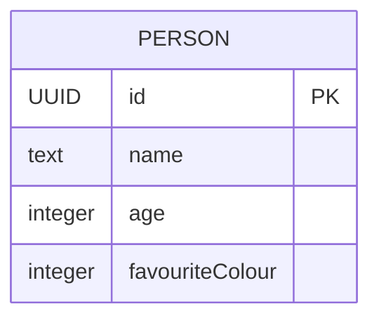
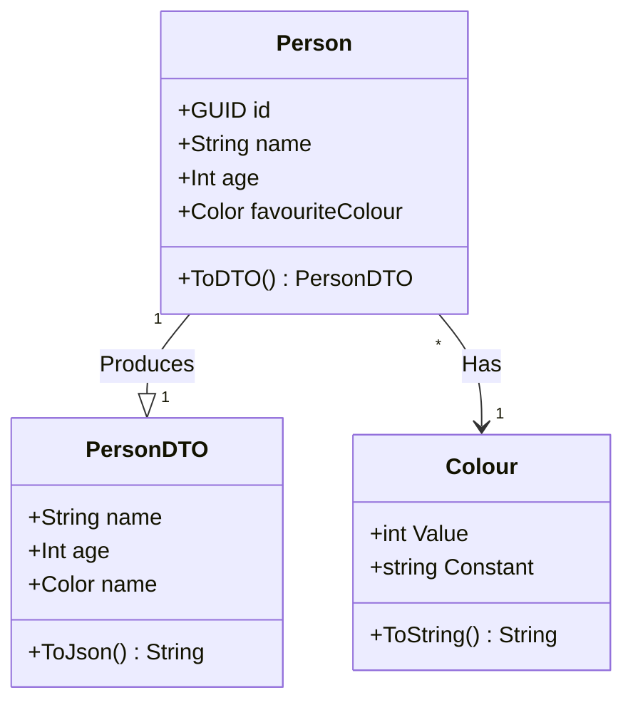

# Entity Relationship Diagram

```mermaid
erDiagram
    PERSON {
        UUID id PK
        text name
        integer age
        integer favouriteColour
    }
```

# Class Diagram

```mermaid
classDiagram
    Person "1" --|> "1" PersonDTO: Produces
    Person "*" --> "1" Colour: Has
    Person : +GUID id
    Person : +String name
    Person : +Int age
    Person : +Color favouriteColour
    Person: +ToDTO() PersonDTO
    class Colour {
        +int Value
        +string Constant
        +ToString() String
    }
    class PersonDTO {
        +String name
        +Int age
        +Color name
        +ToJson() String
    }
```